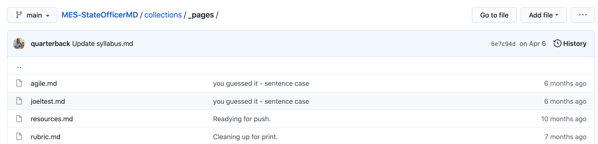
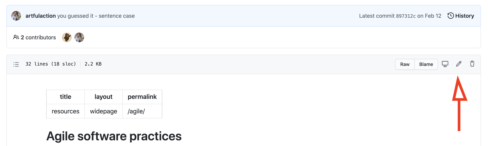
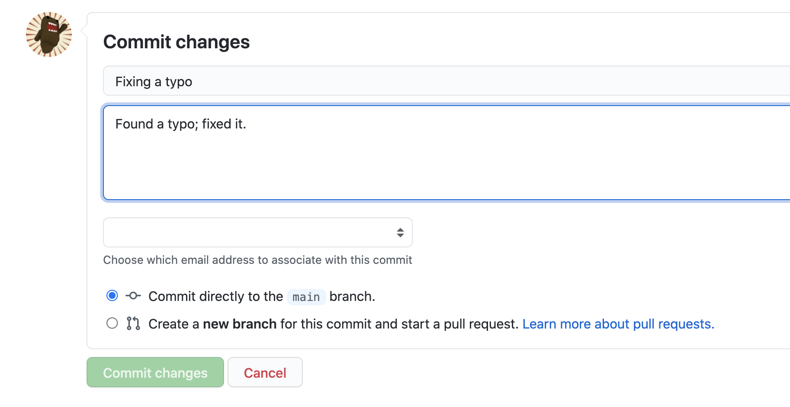

# Maintaining the site

This is a **live site**. What that means is edits made to this repository will result in changes being visible on the WWW. For minor edits (spelling corrections, etc.), this is not typically a concern. For major edits, it could be important to test the site locally before committing changes. Why? Because a commit is equivalent to publishing the edits publicly.

## The (simple) workflow

If you find a typo that you want to correct in the site, your workflow will look like this. First, find the page you want to edit. I'll use the `agile.md` file in the `_pages` directory as an example.



Click on `agile.md`, and then the pencil icon in the upper right-hand side of the page. This lets you edit the file directly in Github.



Now, edit away! Hopefully, you're only making a quick change... for example, correcting a typo someone made. When you're done, write a descriptive commit message. It is good practice to leave a note for people in the future that makes clear what you did.



Admittedly, when fixing a typo, your commit message might be brief. If your edits are more substantial, you may want to explain why you made the edits/changes/additions that you did.

When you're done, hit **Commit changes**. This will add your changes to the site, and Github will automatically begin working to publish your site. It takes around 1-2 minutes for the GH Pages site to update.

## The (more complex) workflow

If you have more substantial changes, you should do the edits on your local machine, view/verify your edits locally, and *then* commit them to the repository. 

First, you'll need to install docker, and run it. On Mac and Windows, this is a double-click process. 

You'll then need to check out the repository.

```
git clone git@github.com:CMSgov/MES-StateOfficerMD.git
```

To begin the edit/check cycle, you'll now need to run the docker container included in the repository for previewing the site. On the command line, `cd` into the directory with the repository. (These instructions are written with a Mac/UNIX flavor.)

```
docker compose up
```

Some things should go by that look kinda like:

```
√ MES-StateOfficerMD % docker compose up                                                                                                (main)MES-StateOfficerMD
[+] Building 0.3s (11/11) FINISHED                                                                                                                               
 => [internal] load build definition from Dockerfile                       
 => => transferring dockerfile: 373B
 => [internal] load .dockerignore 0.1s
 => => transferring context: 2B 0.0s
 => [internal] load metadata for docker.io/library/ruby:2.6.6 0.0s
 => [1/6] FROM docker.io/library/ruby:2.6.6 0.0s
 => [internal] load build context 0.0s
 => => transferring context: 316B 0.0s
 => CACHED [2/6] RUN apt-get update &&   apt-get install --reinstall -y locales &&   sed -i 's/# en_US.UTF-8 UTF-8/en_US.UTF-8 UTF-8/' /etc/locale.gen &&   0.0s
 => CACHED [3/6] RUN mkdir -p /app 0.0s
 => CACHED [4/6] WORKDIR /app 0.0s
 => CACHED [5/6] COPY Gemfile /app 0.0s
 => CACHED [6/6] RUN bundle install 0.0s
 => exporting to image 0.0s
 => => exporting layers 0.0s
 => => writing image sha256:f0546217616c9280d76a036543f3 0.0s
 => => naming to docker.io/library/mes-stateofficermd_ruby 0.0s

[+] Running 3/3
 ⠿ Network mes-stateofficermd_default   Created 0.3s
 ⠿ Container mes-stateofficermd_node_1  Started 1.1s
 ⠿ Container mes-stateofficermd_ruby_1  Started 1.4s
Attaching to node_1, ruby_1
node_1 exited with code 0
ruby_1  | Configuration file: /app/_config.yml
ruby_1  | Configuration file: /app/_local.yml
ruby_1  |             Source: /app
ruby_1  |        Destination: /app/_site
ruby_1  |  Incremental build: disabled. Enable with --incremental
ruby_1  |       Generating... 
ruby_1  |                     done in 34.035 seconds.
ruby_1  |  Auto-regeneration: enabled for '/app'
ruby_1  |     Server address: http://0.0.0.0:4000/
ruby_1  |   Server running... press ctrl-c to stop.
```

The important bit is at the end; this gives you a URL for the site on your local machine. You can probably hold down the command key on the Mac and click on the URL to open up the SOMD site in your browser.

### Editing and checking

Now, you 1) can edit text, 2) save changes, and 3) reload pages to see your work. This is useful when you're working on the layout of pages, or writing larger chunks of text. 

Remember that the site is relatively complex, and we have [documented the care and feeding](collections/_admin/careandfeeding.md) as well as provided [a content guide](collections/_admin/contentguide.md). For consistency, we would recommend following these guides. If you choose to break consistency, you are breaking consistency for your learners.

### Dealing with errors

If you write some broken Liquid markup (the stuff in curly brackets), or do something that causes an error, it will show up in the Jekyll build on the command line. **Fix all the errors before you commit.** If you commit broken code, the GH Pages site **will not build**. That's all there is to it. GH will give you some feedback, but you should be able to fix the errors locally before pushing them live.
### Committing

When you're done with your edits, you can commit and push your changes. You can do a 

```
git status
```

to see what has changed, a

```
git add -A
```

to add any and all new files you may have created, and 

```
git commit -a
```

to commit all of your changes. (Please note: this is not a `git` primer. If you are unfamiliar with git, then you should be wary of simply copy/pasting those commands.)

Once you have committed your changes, you are (again) making changes to the live site. Github will attempt to build your site, and if there are no errors, your changes will be reflected on the live site in a few minutes.

## Collaboration

What follows are two brief overviews of how you can collaborate with colleagues on editing and maintaining the site.

Both of the collaboration mechanisms (branching and forking) are presented as skeletal processes. They assume knowledge of `git`, and they assume you're working as a team editing the content. If only one person is touching the site, and/or the scope of edits being made is typically small, then the assumption is that you will be editing directly in Github, or simply working locally directly on the `main` branch.

We do recommend, at the least, that you work locally as opposed to in the GH interface. This lets you preview your work in a browser, and make sure that you are not committing build-breaking errors to the GH Pages site. If you're making large changes, we recommend branching first, so you can commit your changes for others to see, but not impact the live site. (Branching and merging, when you're the only person working on something, is not that scary. You get used to it with practice.) 

Having a lightweight content review process is a good thing. You'll know you need one when multiple people start colliding with each-other in their writing. 

### Collaboration: editing in branches

One possible way to coordinate and preview changes without publishing to the live site is to use a branch. While in the repos, you can do something like:

```
git checkout -b newbranchname
```

where the `newbranchname` can be anything you want. (E.g. "new-lesson.") Then, you can commit and push changes to the *branch*, and those will not be reflected on the live site.

A colleague could pull down your branch, view changes locally, and even make changes that get pushed back to the branch. In this way, when you both like the new text/changes, you can *merge* those changes back into `main`. The act of merging into `main` will then make the changes live.

This is one way to handle collaboration. It doesn't provide a "live" view of the site, but it does provide a way to share changes without sharing them on the live GH Pages site. If you're dealing with two people making edits, and you want to review things before they go live in an informal way, this is a good strategy to follow.

Another way is to use a fork. 

### Collaboration: `staging` and `production`

In its current use scenario, there are (at most) 50 people looking at the site. In any given cohort, you might have 6-8 people. Therefore, if you make a typo, or break the layout of a page... you're probably not going to inconvenience people for a long time. 

That said, none of us likes to break the website. 

A way to avoid breaking the live site would be to have a "staging" site. This adds a layer of process. This might be done in the following way:

1. Fork the existing site in Github.
2. Follow all above process *on the fork*.
3. Set up a GH pages site on the fork, for previewing/sharing the results.
4. Do a pull request against the live site to get changes reviewed.
5. After review, merge in the changes.

This process would let changes be made to a non-live site, provide a mechanism for review, and a way to "gatekeep" the changes coming in (accepting/rejecting PRs). 
