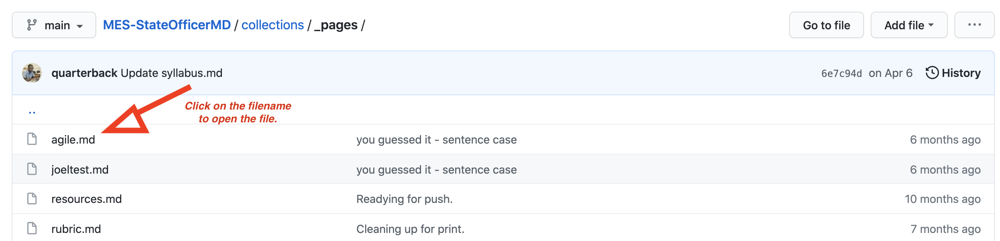

# Maintaining the site

This is a **live site**. What that means is edits made to this repository will result in changes being visible on the WWW. For minor edits (spelling corrections, etc.), this is not typically a concern. For major edits, it could be important to test the site locally before committing changes. Why? Because a commit is equivalent to publishing the edits publicly.

## The (simple) workflow

If you find a typo that you want to correct in the site, your workflow will look like this. First, find the page you want to edit. I'll use the `agile.md` file in the `_pages` directory as an example.

Click on `agile.md`, and then the pencil icon in the upper right-hand side of the page. This lets you edit the file directly in Github.

Now, edit away! Hopefully, you're only making a quick change... for example, correcting a typo someone made. When you're done, write a descriptive commit message. It is good practice to leave a note for people in the future that makes clear what you did.

Admittedly, when fixing a typo, your commit message might be brief. If your edits are more substantial, you may want to explain why you made the edits/changes/additions that you did.

When you're done, hit **Commit changes**. This will add your changes to the site, and Github will automatically begin working to publish your site. It takes around 1-2 minutes for the GH Pages site to update.

## The (more complex) workflow

If you have more substantial changes, you should do the edits on your local machine, view/verify your edits locally, and *then* commit them to the repository. 

